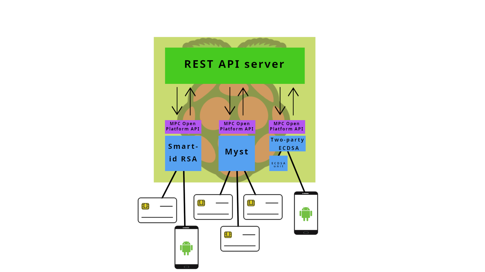

# Open Platform for Multiparty Signatures with Smartcards


This project aims to create an open platform that uses sets of smartcards connected to a Raspberry Pi and allows execution of several Secure Multiparty Computation protocols. 

## Features

* it provides environment and tools for installation of MPC architectures such as [Myst](https://backdoortolerance.org/) or [Smart-ID RSA](https://research.cyber.ee/~peeter/research/esorics2017.pdf)
* users can control specific nodes from a browser client.

## Architecture 

An MPC node consists of:
* a Raspbian OS (or any Debian-based OS)
* MPC protocols that implement the MPC Open Platform interface
* a HTTP server with websockets that allows users to control nodes.
* Connected smartcards that perform computations

<div style="text-align:center">



</div>

## Global view
A network of MPC nodes can be used as a single node.

<div style="text-align:center">


</div>

## Installation

1. Set up the MPCOP repository on your system using the script provided by [packagecloud.io](https://packagecloud.io/)
    ```bash
    $ curl -s https://packagecloud.io/install/repositories/kristian_mika/mpcop/script.deb.sh | sudo bash
    ```
2. Update your package indices
    ```bash
    sudo apt-get update
    ```
3. Install MPCOP
    ```bash
    sudo apt-get install mpcop
    ```
4. After the installation has been completed, the application is running and ready to use on port 8083.

## Run Using Docker

```bash
docker pull mpcop/mpcop:latest
docker run --device /dev/bus/usb -p 8082:8082 -p 8083:8083 mpcop/mpcop:latest
```
## Package

We encourage you to use the prepared pipeline that builds the package for you.

### Package Locally

1. Build the frontend server
    ```bash
    cd mpcop-web
    npm install # to install dependencies
    npm build
    ```
    Static files of the server are in the `mpcop-web/build` folder.
2. Build the app
    ```bash
    cp mpcop-web/build/* mpcop/static/ # copy static files
    git submodule update --init --recursive # clone submodules
    mk-build-deps --install --tool 'apt-get --assume-yes' --root sudo --remove # install build dependencies
    dpkg-buildpackage -b -us -uc # create a package
    ```

There might be a convenience script for local packaging in the future (TODO).

## Development

To test your changes, you can take advantage of the React development server by running
```bash
npm start
```
The development server runs by default on [localhost:3000](localhost:3000).

To run the backend, type
```bash
gradle run
``` 
