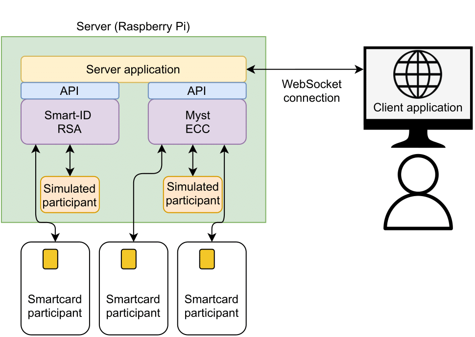
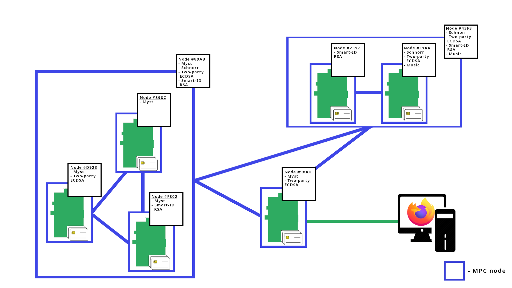

# Open Platform for Multiparty Signatures with Smartcards
[](https://github.com/KristianMika/MPC-Open-Platform/actions/workflows/mpcop.yaml)
[](https://is.muni.cz/th/ee2j3/)

This project aims to create an open platform that uses sets of smartcards connected to a Raspberry Pi and allows the execution of several Secure Multiparty Computation protocols. 

## Features

* configuration, administration, and execution of MPC protocols
  * currently supported protocols are [Myst](https://backdoortolerance.org/) and [Smart-ID RSA](https://research.cyber.ee/~peeter/research/esorics2017.pdf)
* remote connection - users can access the back-end application installed on a remote computer over the network

## Architecture 

The back-end application:
* can run on any operating system 
* runs on the JVM
* contains MPC protocols
* communicates with smartcards

<div style="text-align:center">



</div>

The front-end browser application:
* provides GUI
* communicates with the back-end application using WebSockets

## Goal 
* MPCOP instances can cooperate and collectively compute MPC signatures.
* MPCOP instances make up networks.
* A network can represent a single instance.

<div style="text-align:center">



</div>

## Repository structure
```txt
.
├── Dockerfile - MPCOP Dockerfile
├── mpcop - The back-end application
├── mpcop-web - The front-end React application 
├── pcsc-build - A script for PC/SC software build
└── ping - A simple applet that is used for MPCOP performance measurement
```

## Installation from a Debian Package

1. Set up the MPCOP repository on your system:
    ```bash
    echo "deb https://packagecloud.io/kristian_mika/mpcop/any/ any main" | sudo tee --append /etc/apt/sources.list.d/kristian_mika_mpcop.list
    echo "deb-src https://packagecloud.io/kristian_mika/mpcop/any/ any main" | sudo tee --append /etc/apt/sources.list.d/kristian_mika_mpcop.list
    curl -L "https://packagecloud.io/kristian_mika/mpcop/gpgkey" 2> /dev/null | sudo apt-key add -
    ```
2. Update your package indices
    ```bash
    sudo apt-get update
    ```
3. Install MPCOP
    ```bash
    sudo apt-get install mpcop
    ```
4. After the installation has been completed, the application is running as a systemd service.
5. To access the application navigate to [localhost:8082](http://localhost:8082)

## Run Using Docker

Please note it may not be possible to communicate with smartcards when running on Docker on Windows.
This is caused by the fact that Docker for Windows uses Hyper-V.  Hyper-V does not support USB passthrough.

```bash
docker pull mpcop/mpcop:latest
docker run --detach --device /dev/bus/usb -p 8082:8082 mpcop/mpcop:latest
```

## Test

### Front-end

```bash
cd mpcop-web
npm test --all
```

### Back-end

```bash
cd mpcop
./gradlew :test
```

## Package

We encourage you to use the prepared pipeline that builds the package for you.

### Package Locally

1. Build the front-end server
    ```bash
    cd mpcop-web
    npm install # to install dependencies
    npm build
    ```
    Static files of the server are in the `mpcop-web/build` folder.
2. Build the app
    ```bash
    cp mpcop-web/build/* mpcop/static/ # copy static files
    git submodule update --init --recursive # clone submodules
    mk-build-deps --install --tool 'apt-get --assume-yes' --root sudo --remove # install build dependencies
    dpkg-buildpackage -b -us -uc # create a package
    ```

There might be a convenience script for local packaging in the future.

## Development

To test your changes, you can take advantage of the React development server by running
```bash
cd mpcop-web
npm start
```
The development server runs by default on [localhost:3000](http://localhost:3000).

To run the back-end, type
```bash
cd mpcop
gradle run
``` 

## Script to Compile PCSC

PCSClite is an implementation of the PC/SC international standard for PC to smartcard reader communication. It's a middleware to access smartcard readers.
CCID is a generic smartcard driver. Both limit the maximum number of simultaneously connected card readers. This script downloads and extracts the required packages, modifies the source code to enable communication with more than 16 card readers and builds new packages.

### How to Build

The provided script is intended to be executed in a Docker container, but you can also run it directly on your host machine. In that case, don't forget to install the required packages from the Docker file.


#### Build in Docker

1. Build a docker image
    ```bash
    cd pcsc-build
    docker build --tag mpcop/pcsc-build .
    ```

2. Run the built image
    ```bash
    # create a new folder for the build packages
    mkdir release
    docker run -it --rm -v `pwd`/release:/release mpcop/pcsc-build
    ```

3. The `./release` folder now contains all required PC/SC packages. Install them using
    ```bash
    cd release
    sudo apt install ./*
    ```
